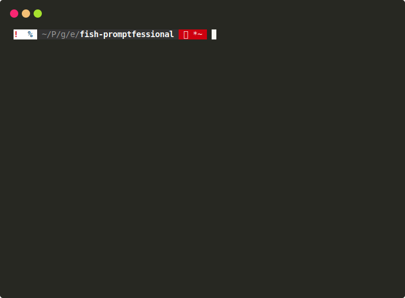

# Promptfessional

Your flexible and highly-customizable Fish shell prompt.



Default theme inspired by [bobthefish](https://github.com/oh-my-fish/theme-bobthefish).


## Install

With [fisher](https://github.com/jorgebucaran/fisher):

```fish
fisher add eth-p/fish-promptfessional

function fish_prompt
  promptfessional_default_prompt
end

funcsave fish_prompt
```

Check out the [build your own prompt section](#build-your-own-prompt) for info on how to customize your prompt.


## Why choose Promptfessional?

Promptfessional is a great choice if you want to:

- Customize your prompt without doing everything from scratch.
- Add your own prompt components without worrying about updates.
- Have a prompt that's both stylish and fast (<50ms).

## How it works

Promptfessional is all about giving you the power to customize your own prompt. To do this, Promptfessional takes a modular approach to displaying prompts.

Your prompt is divided into sections, and each section contains one or more components. Individual components display some kind of useful information, such as the number of running jobs, or the path of the working directory.

### Build your own prompt

Don't like the default prompt? That's ok, you can customize it however you like. Let's take a look at the default to see how to customize a prompt:

```fish
function fish_prompt
    promptfessional section status --delimiter=' '
        promptfessional show status
        promptfessional show jobs
        promptfessional show sudo

    promptfessional section path --pattern=' %s'
        promptfessional show path \
        	--collapse-home \
        	--abbrev-parents \
        	--decoration promptfessional_decoration_git \
        	--git-hide-branch main \
        	--git-hide-branch master 

    promptfessional end
    promptfessional literal " "
end
```

When you call `promptfessional section [name]`, you're creating a new prompt section. Subsequent calls to `promptfessional show [component]` will add a component to your section.

For the "status" section above, you can see that it's made up of three components:
- `status`, which shows the exit code of the last command.
- `jobs`, which shows you if any background jobs are running.
- `sudo`, which shows you if you're running a root shell.

When any of these components are visible, they will be displayed in order of first appearance.

You might also notice that the section also has an option, `--delimiter=' '`. This tells Promptfessional to put a space between each displayed component within this section.

Next, let's look at the "path" section. This section only has the `path` component, but that component has a bunch of different options. You can find out about most of them [in the documentation](#documentation), but here's a quick mention for the `--decoration` option:

Decorations are special components that are applied to individual directories in the path. These display contextual info about their respective directories (e.g. git status).

### Build your own component

See [docs/custom_component.md](docs/custom_component.md) for custom components.

See [docs/custom_decoration.md](docs/custom_decoration.md) for custom path decorations.


## Documentation

Want to learn more about the available components and options?
Check out the documentation for built-in components:

### Core

- [promptfessional color](docs/promptfessional_color.md)
- [promptfessional section](docs/promptfessional_section.md)

### Components

- [status](docs/component_status.md)
- [sudo](docs/component_sudo.md)
- [jobs](docs/component_jobs.md)
- [path](docs/component_path.md)

### Path Decorations

- [git](docs/decoration_git.md)
